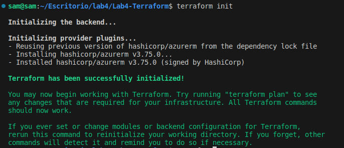
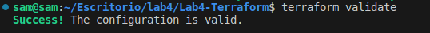
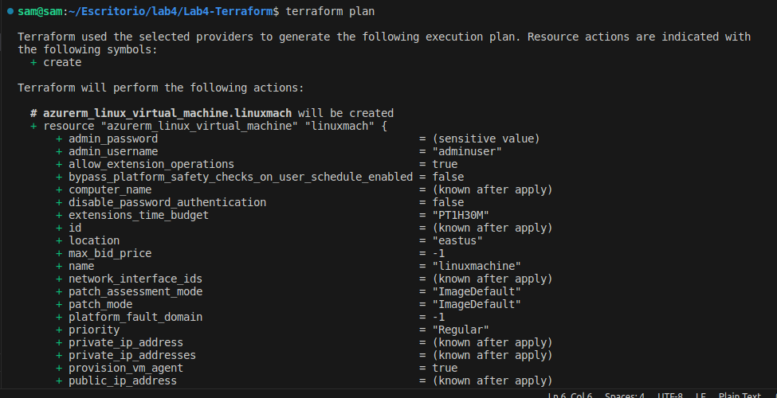
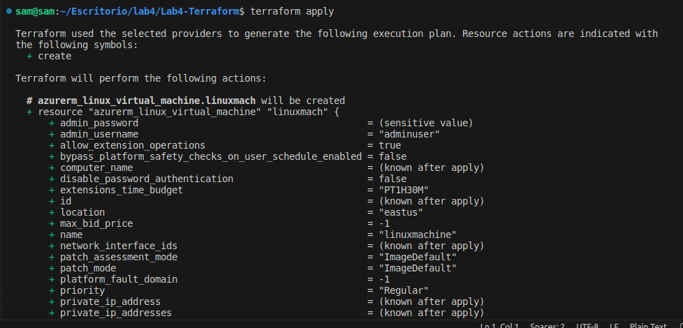
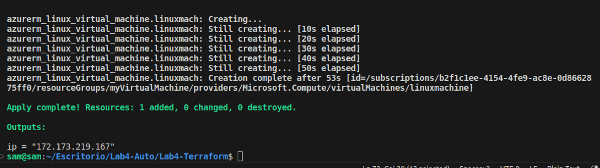
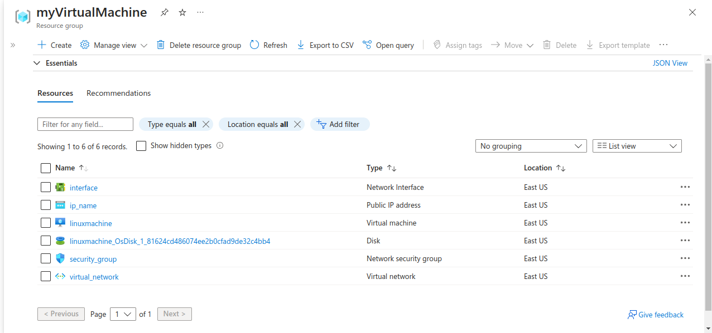
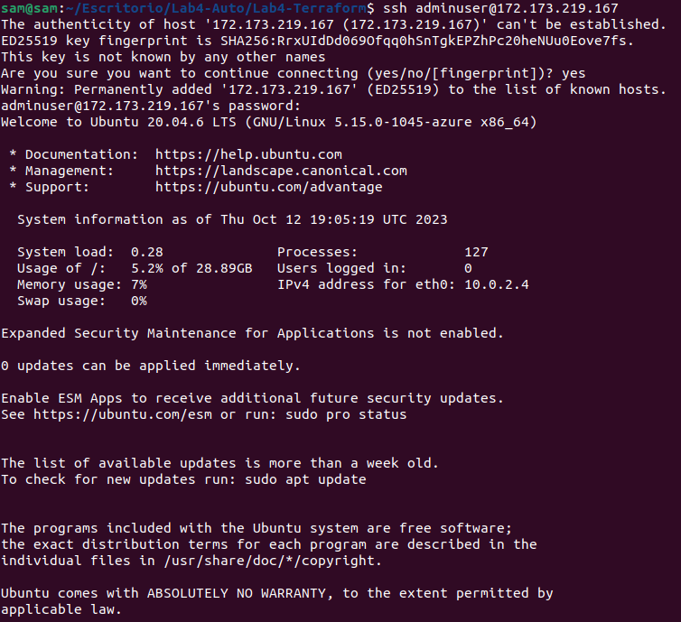
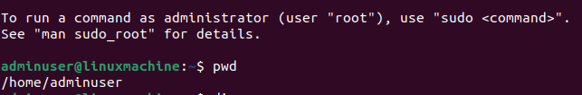
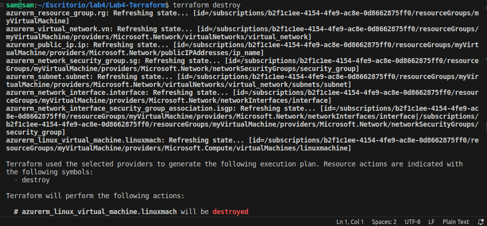

## Azure Infrastructure Deployment with Terraform :rocket:

Welcome to the Azure Infrastructure Deployment project! This repository contains code to automate the deployment of infrastructure resources in Microsoft Azure using Terraform.

### Overview :telescope:

This project aims to simplify the process of setting up a basic Azure infrastructure, complete with a virtual network, subnets, network security rules, and a Linux virtual machine. By leveraging Terraform, you can easily define and provision your Azure resources as code, making infrastructure management more efficient and consistent.

### Files :file_folder:

- **main.tf**

  In this file, you specify the resources, their configurations, and how they are related to each other. It serves as the blueprint for your infrastructure. 
- **variables.tf**

  This file is used to define input variables for your Terraform project.
- **terraform.tfvars**

  Is a file where you assign values to the variables defined in variables.tf. It's a convenient way to provide specific values for your variables without modifying the main configuration code in main.tf.
- **output.tf**

  This file is used to define the output values that you want to display or make available to users after a Terraform run. For this case, we are going to use it to show the public IP of the VM.

### Command execution :hammer_and_wrench:

1. **terraform init:** Initialize a working directory by downloading provider plugins and modules.

2. **terraform validate:** Checks the configuration files for syntax errors and potential issues without making any actual changes.
3. **terraform plan:** Generates an execution plan that outlines what actions Terraform will take to create or modify resources based on your configuration.
4. **terraform apply:** Applies the changes defined in your configuration to create, update, or delete resources in your infrastructure as specified in the execution plan.
5. **terraform destroy:** It is used to terminate and remove all resources defined in the configuration, effectively destroying the infrastructure that was previously created.

### Key Components :key:

1. **Resource Group:** :package:

   Is a logical container that helps manage and organize Azure resources. It provides a way to control access and ensure resources are deployed in a common location.

In this case, we define a resource type named "azurerm_resource_group" which is aliased as "rg." Within this resource, we specify the desired configuration.
    
```
resource "azurerm_resource_group" "rg" {  
  name     = var.virtualmachine
  location = var.location
}
```

2. **Virtual Network:** :electric_plug:

 Virtual Network is an isolated network that allows resources to communicate securely. It acts as a private network where you can define address spaces, subnets, and network security rules.
```
resource "azurerm_virtual_network" "vn" {
  name                = var.virtualnetwork
  address_space       = ["10.0.0.0/16"]
  location            = azurerm_resource_group.rg.location
  resource_group_name = azurerm_resource_group.rg.name
}
```

3. **Subnet:** :triangular_flag_on_post:

Subnets are subdivisions of the virtual network. They provide a way to further segment the network into smaller, manageable segments. Subnets can be used to group related resources or apply different network configurations.
```
resource "azurerm_subnet" "subnet" {
  name                 = var.subnet
  resource_group_name  = azurerm_resource_group.rg.name
  virtual_network_name = azurerm_virtual_network.vn.name
  address_prefixes     = ["10.0.2.0/24"]
}
```

4. **Network Interface:** :computer:

Connects virtual machines and other Azure resources to a network. It serves as the network interface card (NIC) for virtual machines and plays a critical role in enabling network communication.
```
resource "azurerm_network_interface" "interface" {
  name                = var.inter
  location            = azurerm_resource_group.rg.location
  resource_group_name = azurerm_resource_group.rg.name

  ip_configuration {
    name                          = "internal"
    subnet_id                     = azurerm_subnet.subnet.id
    private_ip_address_allocation = "Dynamic"
    public_ip_address_id = azurerm_public_ip.ip.id
  }
}
```

5. **Public IP:** :globe_with_meridians:

Enables resources in Azure to communicate with the external world, such as the internet. It is used to make resources, like virtual machines, accessible from the internet.
```
resource "azurerm_public_ip" "ip" {
  name                = var.ip_name
  resource_group_name = azurerm_resource_group.rg.name
  location            = azurerm_resource_group.rg.location
  allocation_method   = "Static"
}
```

6. **Network Security Group:** :shield:

Is a fundamental element for network security within Azure. It allows or denies inbound and outbound network traffic to resources by defining security rules based on factors like source/destination IP, port, and protocol.
```
resource "azurerm_network_security_group" "sg" {
  name                = var.securitygrp
  location            = azurerm_resource_group.rg.location
  resource_group_name = azurerm_resource_group.rg.name

  security_rule {
    name                       = var.securityrule
    priority                   = 1001
    direction                  = "Inbound"
    access                     = "Allow"
    protocol                   = "Tcp"
    source_port_range          = "*"
    destination_port_range     = "22"
    source_address_prefix      = "*"
    destination_address_prefix = "*"
  }
}
```

7. **Network Interface Security Group:** :lock_with_ink_pen:

Is responsible for associating a Network Security Group with a specific network interface, allowing you to apply security rules at the network interface level, providing granular control over inbound and outbound network traffic for individual network interfaces. 
```
resource "azurerm_network_interface_security_group_association" "isgp" {
  network_interface_id      = azurerm_network_interface.interface.id
  network_security_group_id = azurerm_network_security_group.sg.id
}

```

8. **Linux Virtual Machine:** :computer:

The Linux virtual machine is a cloud-based Linux-based computer that can be customized and deployed. In this case, we define the software version, machine name, user, and password among others.
```
resource "azurerm_linux_virtual_machine" "linuxmach" {
  name                = var.linuxm
  resource_group_name = azurerm_resource_group.rg.name
  location            = azurerm_resource_group.rg.location
  size                = "Standard_F2"
  admin_username      = "adminuser"
  admin_password      = "P@$$w0rd1234!"
  disable_password_authentication = false
  network_interface_ids = [
    azurerm_network_interface.interface.id,
  ]

  os_disk {
    caching              = "ReadWrite"
    storage_account_type = "Standard_LRS"
  }

  source_image_reference {
    publisher = "Canonical"
    offer     = "0001-com-ubuntu-server-focal"
    sku       = "20_04-lts"
    version   = "latest".
  }
}
```


### Evidence
#### terraform init

#### terraform validate


#### terraform plan


#### terraform apply


After we execute ```terraform apply``` we are going to see an ip public that is the result of the definition we made in the file outputs.tf

#### Portal Azure 
We are able to see the virtual machine running on our azure account


#### SSH 
when we get our ip public we can introduce ```ssh adminuser@ippublic ``` in a console so we can access our VM in this case we got the public ip: ```172.173.219.167``` 




we are able to enter the linux machine after entering the password.

#### terraform destroy
Finally if we want we can destory what we have built
