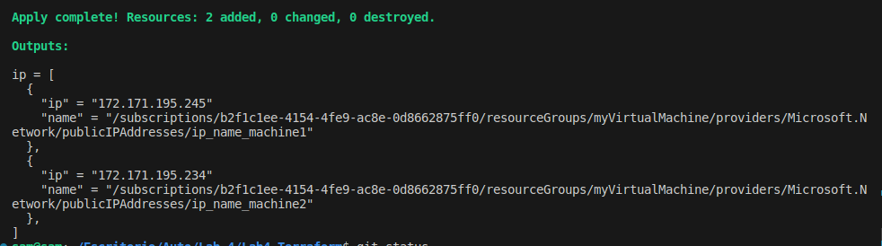
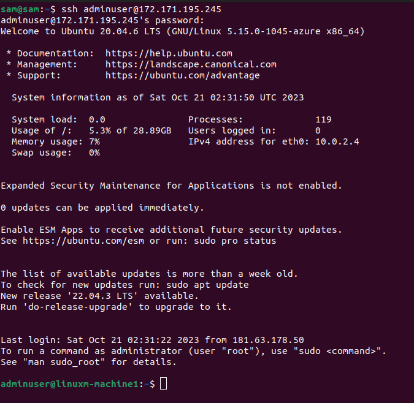
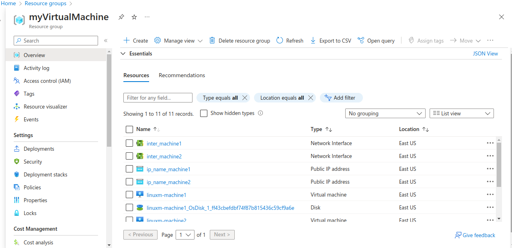

## Azure Infrastructure Deployment with Terraform modules :computer:

The purpose of using Terraform modules is to improve the reusability, maintainability, and organization of your Terraform code. :gear:

### Files :file_folder:

In Terraform, when you're using modules, you typically have a specific directory structure and a set of files for your modules. You might also have similar files at the root level for your main configuration. :open_file_folder:

### modules/vm :computer:

- **main.tf**

  Defines the actual infrastructure resources and configurations specific to the VM module. It contains the resource blocks and other settings necessary to create and configure VM instances. This file defines the core functionality of the module. :building_construction:
- **variables.tf**

  Defines the input variables that the VM module expects. These variables are placeholders for values that will be provided when the module is used. It essentially documents the expected inputs for the module. :pencil:
- **output.tf**

  Defines the output values produced by the VM module. These output values are intended for use in other parts of your Terraform configuration, including in the root module. These outputs allow you to access information or attributes of the resources created by the module. :outbox_tray:

### root :earth_americas:

- **main.tf**

  Defines the top-level configuration for your infrastructure. It may include the instantiation of the module, specifying the inputs required by the module, and possibly any additional configuration that applies to the entire infrastructure. This file ties together the different modules and resources you're using in your Terraform configuration. :world_map:
- **variables.tf**

  It is used to define variables that are used in the top-level configuration. These variables might be used to pass values to the module, configure the overall infrastructure, or store any values you want to parameterize at the top level. :wrench:
- **output.tf**

  Defines outputs that are specific to the entire Terraform configuration. These outputs might capture information from various modules or provide a summary of the infrastructure. You can also reference outputs from modules in this file. :mag:

### Key Components :key:

1. **VM instance :computer:** 

We instantiate the module based on the resources we define in the module main.tf :building_construction:
 
```
module "vm" {
source = "./modules/vm"
ip_name = var.ip_name
resource_group_name = azurerm_resource_group.rg.name
location = azurerm_resource_group.rg.location
inter = var.inter
resource_group_location = azurerm_resource_group.rg.location
subnet_id = azurerm_subnet.subnet.id
securitygrp = var.securitygrp
securityrule = var.securityrule
unique_id = var.unique_id
}
```

### Evidence :bookmark_tabs:

#### terraform apply :rocket:
After apply, we are going to get the two IP addresses, then we can connect via SSH. :white_check_mark:
 :camera_flash:

#### SSH machine 1 :computer:
 :desktop_computer:

#### SSH machine 2 :computer:
 

#### Azure portal :cloud:

 